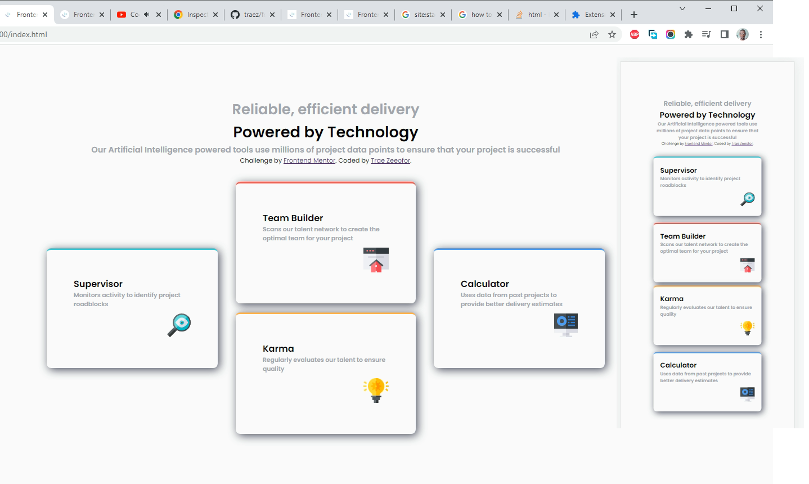

# Frontend Mentor - Four card feature section solution

This is a solution to the [Four card feature section challenge on Frontend Mentor](https://www.frontendmentor.io/challenges/four-card-feature-section-weK1eFYK). Frontend Mentor challenges help you improve your coding skills by building realistic projects. 

## Table of contents

- [Overview](#overview)
  - [The challenge](#the-challenge)
  - [Screenshot](#screenshot)
  - [Links](#links)
- [My process](#my-process)
  - [Built with](#built-with)
  - [What I learned](#what-i-learned)
  - [Continued development](#continued-development)
  - [Useful resources](#useful-resources)
- [Author](#author)
- [Acknowledgments](#acknowledgments)

## Overview

### The challenge

Users should be able to:

- View the optimal layout for the site depending on their device's screen size

### Screenshot

### Links

- Solution URL: [https://github.com/traez/four-card-feature-section-master](https://github.com/traez/four-card-feature-section-master)
- Live Site URL: [https://traez.github.io/four-card-feature-section-master/](https://traez.github.io/four-card-feature-section-master/)

## My process

### Built with

- Semantic HTML5 markup
- CSS custom properties
- Flexbox
- CSS Grid
- Mobile-first workflow

### What I learned

1) Satisfactorily completed this in under 24 hours. Full speed ahead.  
2) Continued romance with CSS Grids, so far so good.  
3) Tried different selector combinations (attribute selectors) here.    
4) Had actual need for box shadow here.  

### Continued development

1) As usual additional middle media query would be nice. But will be a learning priority much later.  
2) As usual also could put more effort into item sizing to make clone exact copy.  

### Useful resources

Stackoverflow, MDN Web Docs, Google

## Author

- Website - [Trae Zeeofor](https://github.com/traez)  
- Frontend Mentor - [@traez](https://www.frontendmentor.io/profile/traez)  
- Twitter - [@trae_z](https://twitter.com/trae_z) 

## Acknowledgments

All the great Athletes that did Nigeria proud at the just concluded CommonWealth Games, Nuff respect!
